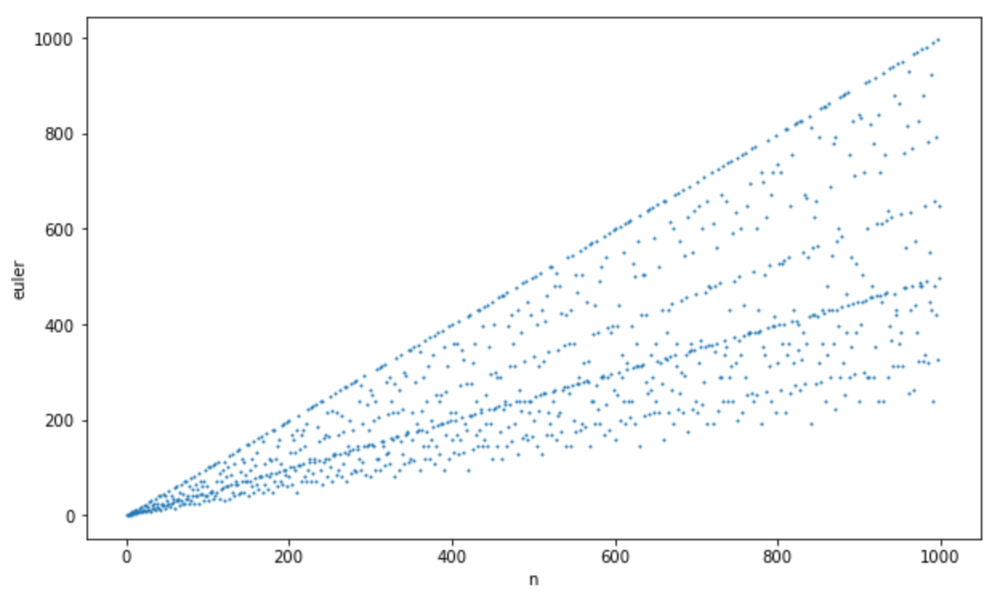
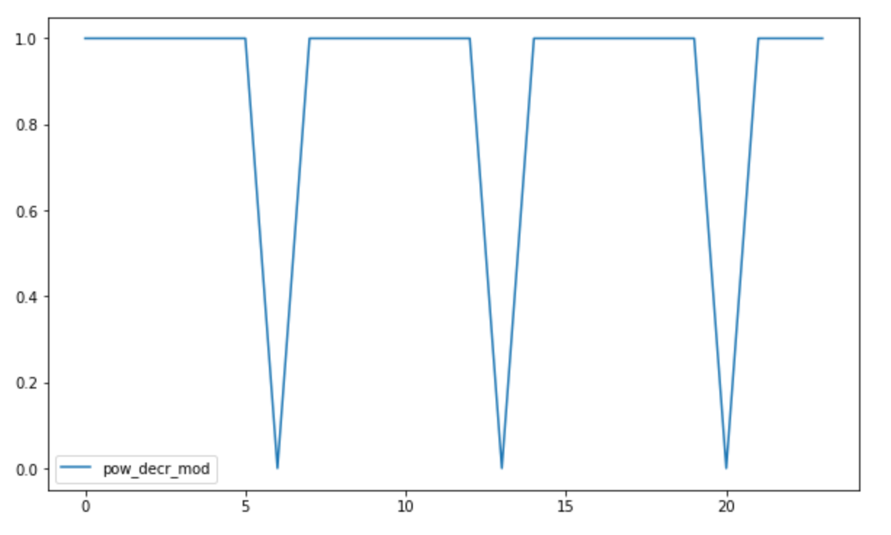

# Some Math Facts

Some mathematical statements and theorems are intuitive.
It's not necessary to take effort to understand them.

But some others are not so intuitive.
It's necessary to have examples and play with data to grasp it.

This repo is for those math facts that require examples and visualization.

It's implemented in form of Jupyter notebook.

## Examples

### Euler's totient function

[Euler's totient function](https://en.wikipedia.org/wiki/Euler%27s_totient_function)
for number n represents amount of numbers coprime with n.

### Fermat's little theorem

[Fermat's little theorem](https://en.wikipedia.org/wiki/Fermat%27s_little_theorem)
describes behaviour of `a^(p-1) mod p` if p is prime.

